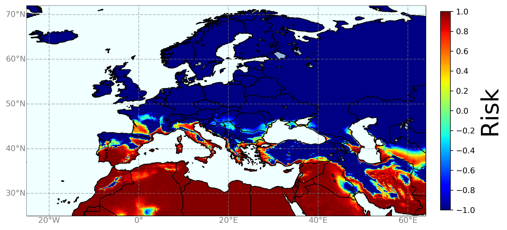

# Global risk predictions for Pierce's disease of grapevines
This repository contains an example of the simulation code used to assess global risk of Pierce's Disease of grapevines, published in [Communications Biology](https://www.nature.com/articles/s42003-022-04358-w)

Table of contents
=================

<!--ts-->
   * [Abstract](#abstract)
   * [Table of contents](#table-of-contents)
   * [Model](#model)
   * [Simulation steps](#simulation-steps)
   * [Run example](#run-example)
   * [Requeriments](#requeriments)
   * [Further usage](#further-usage)
   * [Authors](#authors)
   * [License](#license)
<!--te-->

# Abstract

The clonal lineage of the bacterium *Xylella fastidiosa* (Xf) responsible for Pierce’s disease (PD) poses a threat to viticulture worldwide. Although this vector-transmitted disease has remained mainly restricted to the United States, recent introductions on the islands of Majorca (Spain) and Taiwan have raised concerns about the risk of spreading worldwide. To assess this risk, here we build a climate-driven epidemiological model that simulates PD progression. The model considers the temperature-dependent infection process based on a 3-year inoculation assay and assume local disease propagation when climatic conditions are favourable. The model was successfully validated with spatiotemporal data of the PD distribution in the United States yielding a remarkable ~90% accuracy. Thereafter the model was applied to the main winegrowing regions worldwide, specially focusing in Europe as a case study based on the distribution of the main vector, *Philaenus spumarius*. Our model simulation reveals that most wine-quality producing areas in China, Europe, Argentina, Chile, South Africa, and Australia currently thrive in non-risk or transient-risk zones. To a lesser extent, epidemic-risk zones with low to moderate risk indices appear in coastal zones such as Mallorca and Apulia, where Xf outbreaks have been already detected. The European case shows how models assuming a vector heterogeneous distribution yield lesser extended epidemic-risk zones than previous risk maps. Overall, a global expansion of PD epidemic-risk zones is projected for 2050, although with low increase in risk indices. Our study highlights the importance of considering climate variability and an invasive criterion to obtain precise risk maps for plant health decision-making.

# Model

The model is split in two parts: a transmission layer, that models plant to plant disease transmission annually, and a climatic layer, that accounts for symptom-development as function of temperature (i.e. chronic infections that will contribute to produce new infections)

The transmission layer is based on a standard Susceptible-Infected-Remove (SIR) compartmental model. We are only interested in addressing whether or not the infected population will grow in the future (we model risk), so that the initial exponential approximation of the SIR model is used,

=I(0)\exp(\gamma(R_0-1)t))

Moreover, information on the spatial distribution of the main vector in Europe, *Philaenus spumarius*, is available. Thus, to account for different transmission rates based on differences on vector climatic suitability we scale R0 linearly with this quantity (and thus R0 depends on space).

Now, new infections will become or not chronic at the end of the year (i.e. will still be infective next year) depending on the climatic layer. The climatic layer is based on the interplay between two factors, the Modified Growing Degree Days (MGDD) and the Cold Degree Days (CDD). 

MGDDs are a metric of heat accumulation linked to the temperature-dependent growth rate of Xf (measured in [1]). Thus, it can be shown that MGDDs are directly related to bacterial population growth, modelling bacterial load in infected plants. This metric was thereafter correlated with symptom-development after a three-year inoculation experiment. This allows to build a continuous function bounded between 0 and 1 relating accumulated MGDD in one year with cumulative probability of symptom development, i.e. cumulative probability of developing a chronic infection and be still infective next year. We thereafter refer to this factor as F(MGDD).

CDDs are a metric of cold accumulation used to model the so-called winter curing effect, i.e. infected plants can be cured when exposed to cold temperatures. Experimental data on this effect is not available, so we first correlate the average minimum temperature of the coldest month (Tmin) with CDD accumulation in winter, as has been observed that the disease is not present in zones with Tmin < -1.1ºC [2]. Again, we build a continuous function bounded between 0 and 1 relating accumulated CDD in one year and cumulative probability of keeping infection, i.e. of developing a chronic infection. We thereafter refer to this factor as G(CDD).

Finally, we can integrate both transmission and climatic layers in a single equation

=I(t-1)\cdot\exp(\gamma(R_0-1))\cdot&space;F(MGDD(t))\cdot&space;G(CDD(t)))

This allow us to compute the evolution of the infected population in time. We derive a risk index based on the comparison between the current growth of the infected population at time t and its maximum possible growth

=\textrm{max}\left\(\frac{\log(I(t)/I(0))}{\gamma(R_0-1)\tau},&space;-1&space;\right\))

All this information is summarised in the following scheme


# Simulation steps

Here we describe the simulation steps to assess PD risk. Although the steps are general, we describe them in relation with the example provided in this repository. For details on further usage see [Further usage](#further-usage)

* Download temperature data
  
In our work, temperature data was downloaded from [ERA5-Land dataset](https://cds.climate.copernicus.eu/cdsapp#!/dataset/reanalysis-era5-land?tab=overview) in GRIB format. The necessary data files to run the example can be downloaded runing the `download_data.py` script (see [Run example](#run-example)) or accessing [this zenodo repository](https://zenodo.org/record/6397388#.YkV2wHVBw3F). Take into account that the data to download is about 5GB and the process could take some minutes.

* Compute MGDD and CDD factors

  Once data has been downloaded, the next step is to compute the climatic variables of interest, i.e. MGDD and CDD anual factors. We provide a julia script 'compute_climatic_variables' that is prepared to work with the provided example. The script loads a self-made library described in [this repository](https://github.com/agimenezromero/ERA5-Land-data-analysis) and computes the climatic variables from the data included in the repository. Nevertheless, we also provide the MGDD and CDD factors already computed for this example (the corresponding files are automatically downloaded running the `download example` script).

* Run simulation
  
  In this example we provide the code to simulate only one year of PD progression (more years would require downloading more data files of about 5 GB per year).
  
  The code is as simple as this
  
  ```python
  #Define MGDD factor
  def prob_MGDD(x):

    return 1 / (1 + np.exp(-0.0120*(x-975)))
  
  #Define CDD factor
  def prob_CDD(x):

      return 2e7/(2e7 + x**3)

  #This is the simulation algorithm for 1 time step only (just for testing purposes)
  def disease_simulation(filename_MGDD, filename_CDD, R0=5.0, γ=1.0/5.0, I0=1.0, use_vector=False, 
                         filename_vector="Data/vector_Europe.txt"):

      I = I0

      if use_vector == True:

          vector, lons_v, lats_v = np.loadtxt(filename_vector, unpack=True)

          R0_f = R0 * vector/1000

      else:

          R0_f = R0

      MGDD, lons, lats = np.loadtxt(filename_MGDD, unpack=True)
      CDD, lons, lats = np.loadtxt(filename_CDD, unpack=True)

      prob_1 = prob_MGDD(MGDD)
      prob_2 = prob_CDD(CDD)

      prob_f = prob_1 * prob_2

      I = I * prob_f * np.exp((R0_f-1)*γ)

      risk = np.log(I) / ((R0_f-1)*γ*1)

      risk[risk < -1.0] = -1.0

      return risk, lons, lats
  ```

We can run the simulation easily providing the input filenames where the climatic variables are stored. In the example below we don't consider the vector climatic suitability.

```python
  filename_MGDD = "Data/Europe_2019_hot.txt"
  filename_CDD = "Data/Europe_2019_cold.txt"

  use_vector = False

  risk, lons, lats = disease_simulation(filename_MGDD, filename_CDD, use_vector=use_vector)
```

* Plot risk
  
  To plot the risk maps we use [Cartopy](https://scitools.org.uk/cartopy/docs/latest/#) library.
  
  First, we need to reshape the risk values to a 2D array with its original shape, this is, the shape of the downloaded climatic data. In our self-developed library that computes the climatic variables, (see [this repository](https://github.com/agimenezromero/ERA5-Land-data-analysis)) this shape is saved in the header of the climatic variables output files.
  
  ```python
  Europe_shape = (471, 891) 

  risk = np.reshape(risk, Europe_shape)
  lons = np.reshape(lons, Europe_shape)
  lats = np.reshape(lats, Europe_shape)
  ```
  
  Then, we are ready to plot
  
  ```python
  
    clevels = np.linspace(-1, 1, 100)
    cbar_ticks = np.arange(-1, 1.2, 0.2)

    cmap = 'jet'

    #-- create figure and axes instances
    fig = plt.figure(figsize=(11, 11), dpi=100)
    ax  = fig.add_axes([0.1,0.1,0.8,0.9])

    projection = ccrs.PlateCarree()

    #-- create map
    ax = plt.axes(projection=projection) 

    #-- add map features
    ax.coastlines(resolution='10m') #110m, 50m, 10m
    ax.add_feature(cartopy.feature.LAND, edgecolor='black')
    ax.add_feature(cartopy.feature.LAKES, edgecolor='black')
    ax.add_feature(cartopy.feature.BORDERS, edgecolor='black')
    ax.add_feature(cartopy.feature.OCEAN, zorder=100, edgecolor='black', facecolor='azure')

    cnplot = ax.contourf(lons, lats, risk, clevels, cmap=cmap)

    cbar = plt.colorbar(cnplot, ticks=cbar_ticks, shrink=0.42, pad = 0.03)

    gl = ax.gridlines(crs=projection, linewidth=1, color='gray', alpha=0.5, zorder=200, linestyle='--')

    gl.xlabel_style = {'size': 8, 'color': 'gray'}
    gl.ylabel_style = {'size': 8, 'color': 'gray'}

    gl.bottom_labels = True
    gl.left_labels = True
  ```
  
  
  
  We can run the simulation it again now considering the vector climatic suitability
  
  ```python
  filename_MGDD = "Data/Europe_2019_hot.txt"
  filename_CDD = "Data/Europe_2019_cold.txt"

  use_vector = True

  risk, lons, lats = disease_simulation(filename_MGDD, filename_CDD, use_vector=use_vector)
  ```
  
  which yields the following risk map
  
  


# Run example

- To download the necessary data just run the Python script `download_data.py` via command line as

  `python download_data.py` or in background as `nohup python download_data.py &`
  
  Alternatively, the data can be downloaded from [this zenodo repository](https://zenodo.org/record/6397388#.YkV2wHVBw3F)
  
  A folder named "Data" will be created with all the necessary data inside.

- To compute the climatic variables just run the Julia script `compute_climatic_variables.jl` via command line as
  
  `julia compute_climatic_variables.jl` or in background as `nohup julia compute_climatic_variables.jl &`
  
  However, we also provide the computed climatic variables used for this example in the Data folder.

- To run the simulation just use the jupyter notebook provided (simulation_test.ipynb)

  Some features can be customised:
  
  * R0 (float) - Basic Reproduction Number - Default: 5.0
  * γ (float) - Mortality rate of infected plants - Default: 0.2
  * I0 (float) - Initial number of infected plants - Default: 1.0
  * use_vector (Boolean) - Determines the use of the vector climatic suitability to account for a spatially dependent R0 - Default: False

# Requeriments

### Julia 1.5 or higher installed with the following libraries
- [GRIB.jl](https://github.com/weech/GRIB.jl)
- [DataFrames.jl](https://dataframes.juliadata.org/stable/)
- [Feather.jl](https://github.com/JuliaData/Feather.jl)
- [Dates.jl](https://docs.julialang.org/en/v1/stdlib/Dates/)

### Python 3.x installed with the following libraries
- [Numpy](https://numpy.org/doc/stable/index.html)
- [Matplotlib](https://matplotlib.org/devdocs/index.html)
- [Cartopy](https://scitools.org.uk/cartopy/docs/latest/#)
- [Requests](https://docs.python-requests.org/en/latest/)
- [sys](https://docs.python.org/3/library/sys.html)
- [os](https://docs.python.org/3/library/os.html)

# Further usage

In the presented example we make use of GRIB files to compute the climatic variables (indeed this is the tricky part, the simulation itself is pretty easy). However, for other usages, temperature data could be in different formats, such as .csv or excel.
  
As previously mentioned, the algorithms to compute MGDD and CDD are described in [this repository](https://github.com/agimenezromero/ERA5-Land-data-analysis), athough they are written to be used with GRIB files using Julia. To compute the climatic variables with other data formats the details of the implementation could change for major efficiency.

Anyone interested to use the approach presented here but having troubles in the implementation (e.g. because she/he is using other data formats) can contact us at alex@ifisc.uib-csic.es.
  
# Authors 
- Repository & Code
  * **Alex Giménez-Romero**

- Paper
  * **Alex Giménez-Romero**
  * **Javier Galván Fraile**
  * **Marina Montesinos**
  * **Joan Bauzà**
  * **Martin Godefroid**
  * **Alberto Fereres**
  * **Jose J. Ramasco**
  * **Manuel A. Matias**
  * **Eduardo Moralejo**

# References
[1] [H. Feil and A. Purcell, Temperature-dependent growth and survival of xylella fastidiosa in vitro and in potted grapevines, Plant Disease 85, 1230 (2001).](https://apsjournals.apsnet.org/doi/10.1094/PDIS.2001.85.12.1230)

[2] [H. Feil, W. S. Feil, and A. H. Purcell, Effects of date of inoculation on the within-plant movement of Xylella fastidiosa
and persistence of pierce’s disease within field grapevines, Phytopathology 93, 244 (2003).](https://apsjournals.apsnet.org/doi/10.1094/PHYTO.2003.93.2.244)

# License

This project is licensed under the GNU General Public License v3.0 - see the [LICENSE.md](https://github.com/agimenezromero/Global-risk-predictions-for-Pierce-s-disease-of-grapevines/blob/main/LICENSE) file for details

